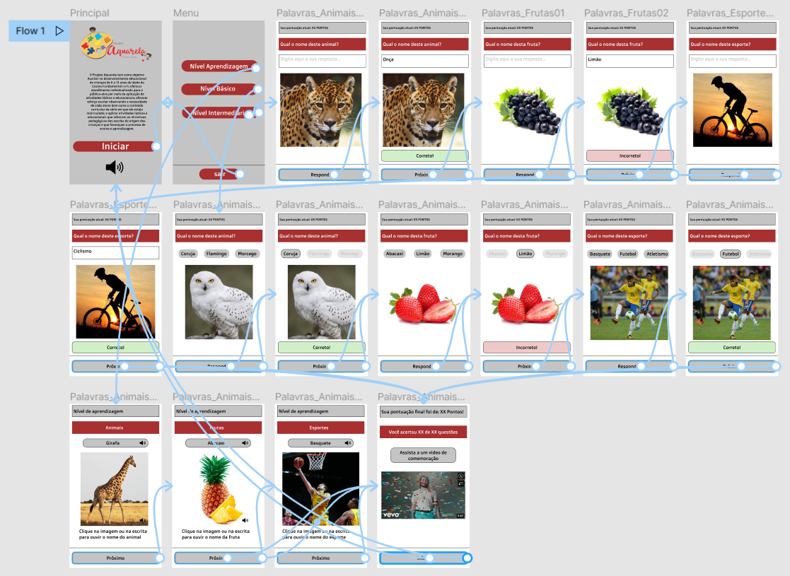
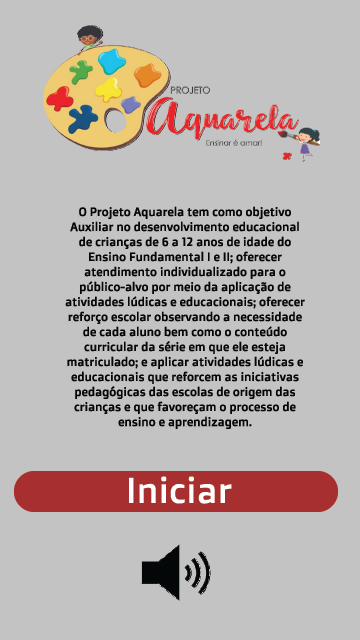
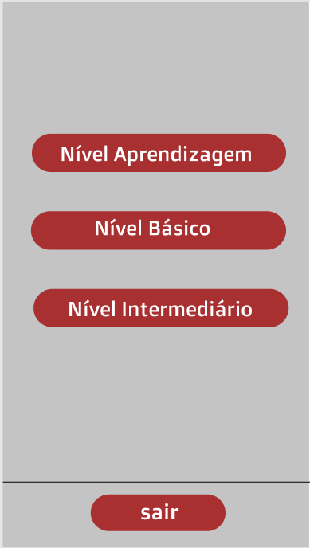
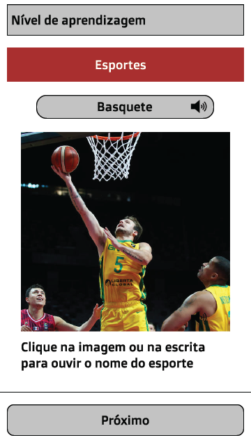
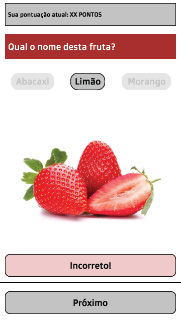
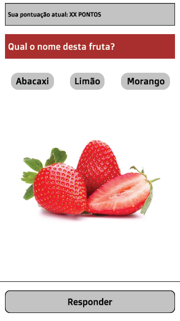
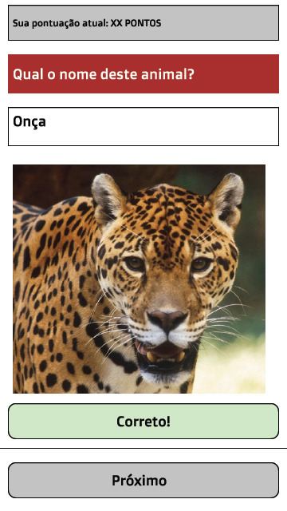
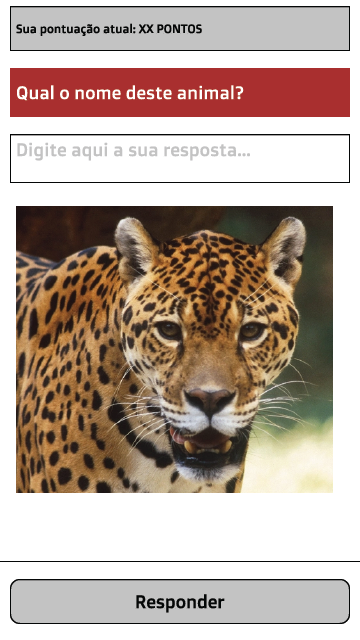

# Projeto de Interface

Pré-requisitos: <a href="2-Especificação do Projeto.md"> Documentação de Especificação</a>

Visão geral da interação do usuário pelas telas do sistema e protótipo interativo das telas com as funcionalidades que fazem parte do sistema (wireframes).

 Apresente as principais interfaces da plataforma. Discuta como ela foi elaborada de forma a atender os requisitos funcionais, não funcionais e histórias de usuário abordados nas <a href="2-Especificação do Projeto.md"> Documentação de Especificação</a>.

Dentre as preocupações para a montagem da interface do sistema, estamos estabelecendo foco em questões como agilidade, acessibilidade e usabilidade. Desta forma, o projeto tem uma identidade visual padronizada em todas as telas que são projetadas para funcionamento ideal do aplicativo. O planejamento do uso do aplicativo é intuitivo e de fácil manuseio.

## User Flow

Fluxo de usuário (User Flow) é uma técnica que permite ao desenvolvedor mapear todo fluxo de telas do site ou app. Essa técnica funciona para alinhar os caminhos e as possíveis ações que o usuário pode fazer.

> **Links Úteis**:
> - [User Flow: O Quê É e Como Fazer?](https://medium.com/7bits/fluxo-de-usu%C3%A1rio-user-flow-o-que-%C3%A9-como-fazer-79d965872534)
> - [User Flow vs Site Maps](http://designr.com.br/sitemap-e-user-flow-quais-as-diferencas-e-quando-usar-cada-um/)
> - [Top 25 User Flow Tools & Templates for Smooth](https://www.mockplus.com/blog/post/user-flow-tools)

## Wireframes

São protótipos usados em design de interface para sugerir a estrutura de um site web e seu relacionamentos entre suas páginas. Um wireframe web é uma ilustração semelhante do layout de elementos fundamentais na interface.

Conforme fluxo de telas do projeto, apresentado no item anterior, as telas do sistema são apresentadas em detalhes nos itens que se seguem. As telas do sistema apresentam uma estrutura comum que é apresentada na Figura abaixo. Nesta estrutura, existem 3 grandes blocos, descritos a seguir. São eles:
●	Tela Inicial - local onde são dispostos elementos fixos de identidade (logo) e navegação principal do site (menu da aplicação);
●	Menu de Opções - apresenta as opções disponíveis dentro do aplicativo;
●	Tela de Jogos - apresenta os elementos para que os usuários interajam com o jogo que escolherem fazer.

### Tela - Inicial

A tela de home-page apresenta do que se trata a aplicação, a logo do projeto e botão iniciar para o menu de opções.

### Tela - Menu de Opções

A tela de Menu de Opções apresenta as opções que o usuário possui para escolher seu jogo.

### Tela - Jogos

A tela de jogos possui diferenciação de layout de interfaces dependendo dos níveis selecionados, sendo eles: Aprendizado; Básico; Intermediário.

> **Links Úteis**:
> - [Protótipos vs Wireframes](https://www.nngroup.com/videos/prototypes-vs-wireframes-ux-projects/)
> - [Ferramentas de Wireframes](https://rockcontent.com/blog/wireframes/)
> - [MarvelApp](https://marvelapp.com/developers/documentation/tutorials/)
> - [Figma](https://www.figma.com/)
> - [Adobe XD](https://www.adobe.com/br/products/xd.html#scroll)
> - [Axure](https://www.axure.com/edu) (Licença Educacional)
> - [InvisionApp](https://www.invisionapp.com/) (Licença Educacional)
